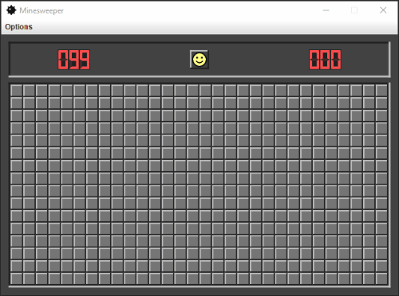

# :rocket: Minesweeper :sunglasses::boom:

:video_game: A dark-mode Minesweeper desktop app built using **JetBrains**
[Compose for Desktop](https://www.jetbrains.com/lp/compose-desktop/).

## :memo: Game details

The game follows the classic rules with 3 built-in levels, as well as a custom level that allows the user to choose 
the size of the game grid and the amount of mines.

## :briefcase: Features

- Recursive expansion of selected cells with no surrounding mines
- Left- vs right-click mouse handling
- Use of `Canvas` to draw composables (including 7-segment digital screens) with a retro feel
- Window menu items trigger pop-up dialogs for: viewing rules, customizing game options
- Pop-up dialog triggered when in-game time exceeded, handled by state holder and `Timer()`
- Text fields validate input while typing and trigger composition of appropriate error messages regardless of focus order
- Robust model and UI test suites

## :computer: Run desktop application

Clone the repository then pick an option:

- Open the project in IntelliJ IDEA and run `Main.kt`

- `./gradlew run` from an open terminal in the root of the project

- Open the Gradle toolbar and select `minesweeper/Tasks/compose desktop/run`

## :microscope: Run tests

Clone the repository then pick an option:

- Open the project in IntelliJ IDEA then choose specific tests using gutter icons or right-click the `src/test` folder and
  select `Run 'Tests in 'minesweeper.test''`

- `./gradlew test` from an open terminal in the root of the project

- Open the Gradle toolbar and select `minesweeper/Tasks/verification/test`